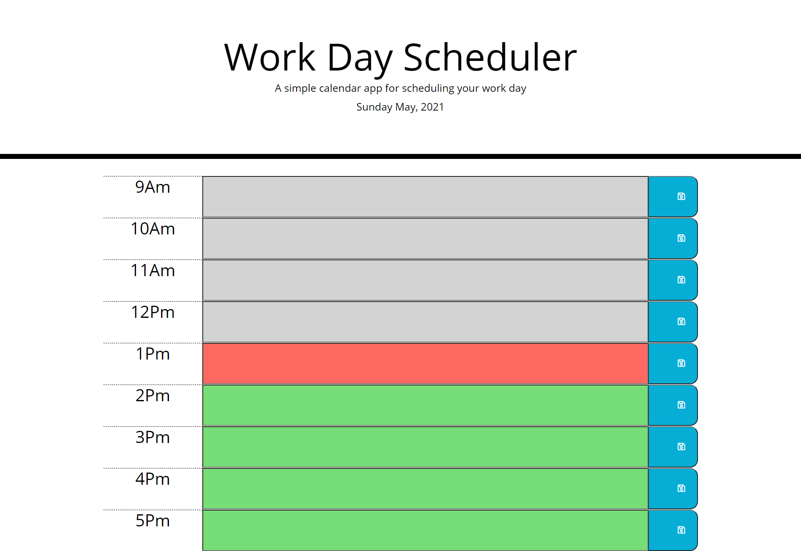

# Day Planner

utilizing moment JS, jquery, and bootstrap, i created a day planner that allows you to locally store information assigned to an hour and
retireive it on a reload of the website, as well as have the input fields change color to indicate, past present or future in relation to the current hour

